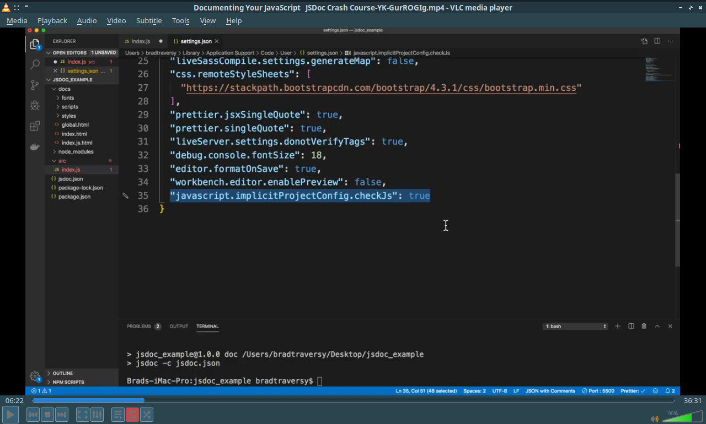
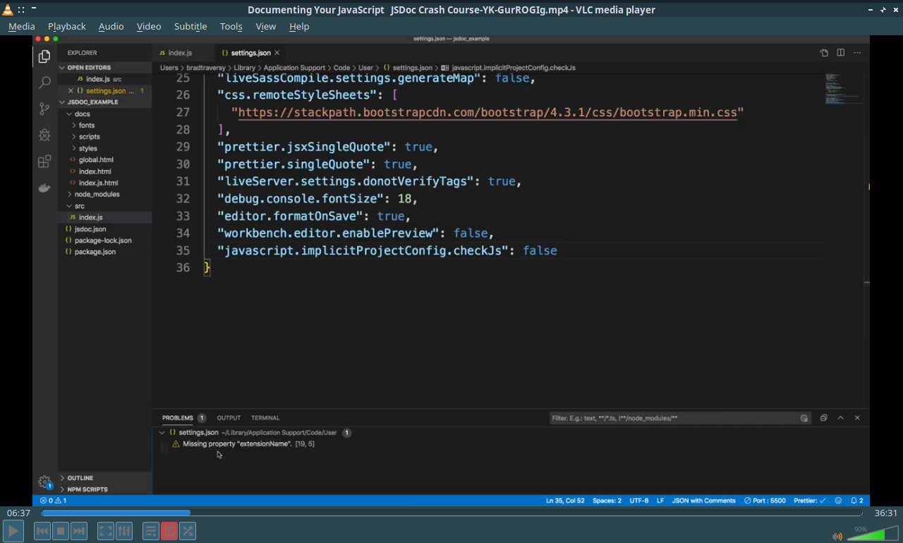
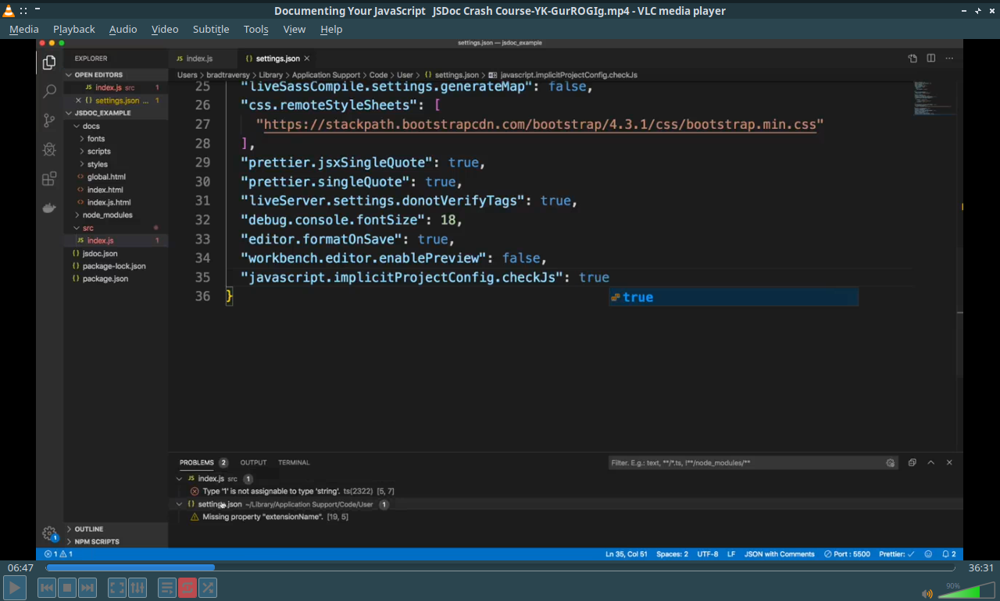
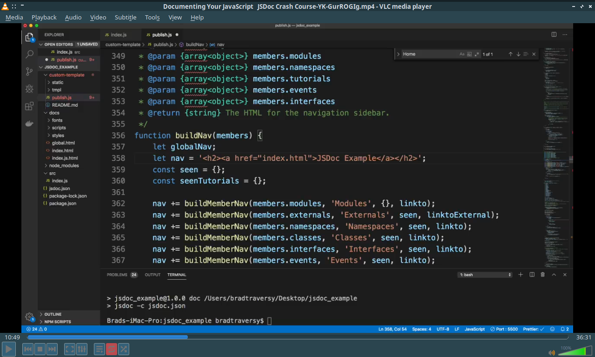
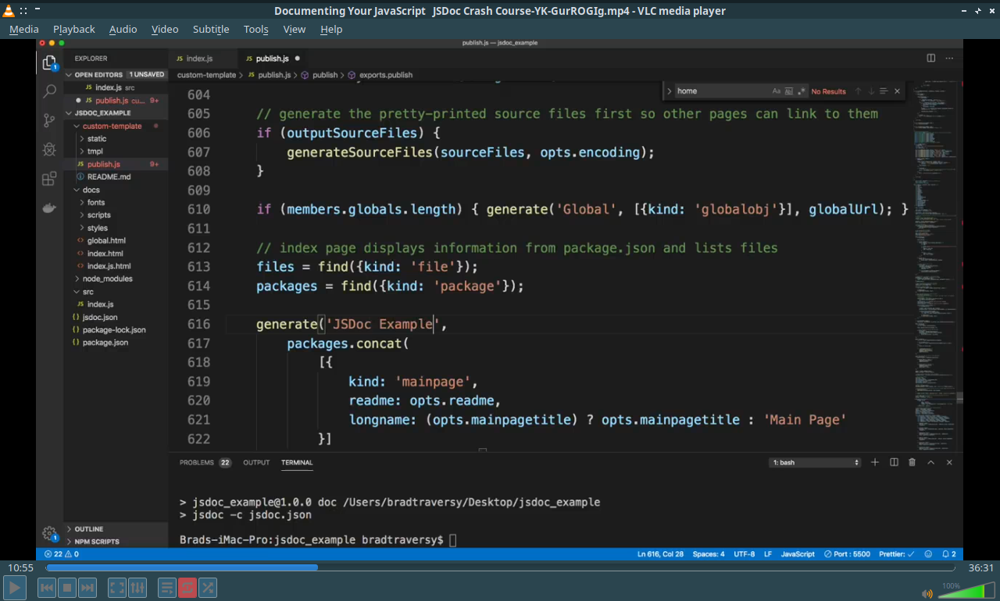

Documenting Your JavaScript JSDoc Crash Course
========================

<!-- MarkdownTOC levels=1,2 -->

- [Cheat Sheets](#cheat-sheets)
  - [`/index.js`](#indexjs)
  - [`/calculator.js`](#calculatorjs)
- [API References](#api-references)
  - [Config](#config)
  - [Tags](#tags)
  - [Data Types](#data-types)
  - [Symbols](#symbols)
- [Setup Steps](#setup-steps)
- [HowTos](#howtos)
  - [Enable Type-Checking](#enable-type-checking)
  - [Changing Templates](#changing-templates)
  - [Adding Tutorials](#adding-tutorials)
  - [Add Readme](#add-readme)
- [Neccessary/Highlights Timestamps](#neccessaryhighlights-timestamps)
- [Additional Implementations in the Project](#additional-implementations-in-the-project)
  - [Config and Package Scripts](#config-and-package-scripts)
  - [Implementations](#implementations)
  - [Utils](#utils)
  - [JSDoc Configs](#jsdoc-configs)
- [Current Bugs](#current-bugs)

<!-- /MarkdownTOC -->

<a id="cheat-sheets"></a>
# Cheat Sheets

<a id="indexjs"></a>
## `/index.js`


```js
// import destructured module for calculator
// project description
// declare 'studentName' string
// declare 'grades' array
// declare 'todo' object
// define 'calculateTax' function: (amount + tax * amount)
// declare 'student' object using the custom type 'Student'
	// id, name, age, isActive
// define 'Person' class
	// define a constructor that takes in 'personInfo'
		// declare a member 'name'
		// declare a member 'age'
	// define 'greet' method
// Declare 'person1' that links to the 'Person' object
// Concole log add method
```

<a id="calculatorjs"></a>
## `/calculator.js`

```js
// export add function
// export multiply function
// export substract function
// export divide function
```

<a id="api-references"></a>
# API References

<a id="config"></a>
## Config

<table>
  <thead>
    <tr>
      <th style="text-align: left;">Property</th>
      <th style="text-align: left;">Value or/and Data Type</th>
      <th style="text-align: left;">Definition/Description</th>
    </tr>
  </thead>
  <tbody>
    <tr>
      <td style="text-align: left;"><code>source</code></td>
      <td style="text-align: left;"><code>Object | String???</code></td>
      <td style="text-align: left;">Where JSDoc is gonna look</td>
    </tr>
    <tr>
      <td style="text-align: left;"><code>source.include</code></td>
      <td style="text-align: left;"><code>path: String[]</code></td>
      <td style="text-align: left;">
        * We’re going to have a folder called source <br/>
        * Array of different folders
      </td>
    </tr>
    <tr>
      <td style="text-align: left;"><code>source.includePattern</code></td>
      <td style="text-align: left;"><code>fileFormat: String&lt;RegExp&gt;</code></td>
      <td style="text-align: left;">Include anything that ends with the specified regex pattern for file format</td>
    </tr>
    <tr>
      <td style="text-align: left;"><code>source.excludePattern</code></td>
      <td style="text-align: left;"><code>path: String&lt;RegExp()&gt;</code></td>
      <td style="text-align: left;">Exclude any specified regex pattern for folder</td>
    </tr>
    <tr>
      <td style="text-align: left;"><code>plugins</code></td>
      <td style="text-align: left;"><code>String[]</code></td>
      <td style="text-align: left;">This part will allow allow you to use markdown</td>
    </tr>
    <tr>
      <td style="text-align: left;"><code>templates</code></td>
      <td style="text-align: left;"><code>Object</code></td>
      <td style="text-align: left;"></td>
    </tr>
    <tr>
      <td style="text-align: left;"><code>templates.cleverLinks</code></td>
      <td style="text-align: left;"><code>Boolean</code></td>
      <td rowspan="2" style="text-align: left;">This is just going to make it so that when you have links within your documentation it’ll have a mono space font</td>
    </tr>
    <tr>
      <td style="text-align: left;"><code>templates.monospaceLinks</code></td>
      <td style="text-align: left;"><code>Boolean</code></td>
    </tr>
    <tr>
      <td style="text-align: left;"><code>opts</code></td>
      <td style="text-align: left;"><code>Object</code></td>
      <td style="text-align: left;"></td>
    </tr>
    <tr>
      <td style="text-align: left;"><code>opts.recurse</code></td>
      <td style="text-align: left;"><code>Boolean</code></td>
      <td style="text-align: left;">Allows us to basically recurse into subfolders okay so it’ll look below just the root level</td>
    </tr>
    <tr>
      <td style="text-align: left;"><code>opts.destination</code></td>
      <td style="text-align: left;"><code>path: String</code></td>
      <td style="text-align: left;"></td>
    </tr>
    <tr>
      <td style="text-align: left;"><code>opts.template</code></td>
      <td style="text-align: left;"><code>path: String</code></td>
      <td style="text-align: left;"></td>
    </tr>
    <tr>
      <td style="text-align: left;"><code>opts.tutorials</code></td>
      <td style="text-align: left;"><code>path: String</code></td>
      <td style="text-align: left;"></td>
    </tr>
    <tr>
      <td style="text-align: left;"><code>opts.readme</code></td>
      <td style="text-align: left;"><code>file: String</code></td>
      <td style="text-align: left;"></td>
    </tr>
  </tbody>
</table>

<a id="tags"></a>
## Tags

|Tags|Syntax|Definition/Description|Examples|
|:----|:----|:----|:----|
|`@type`|`@type {<type>}`|Data Type|`@type {string}`|
|`@param`|`@param {<dataType>} <paramName> - <desc>`|Function Parameter(Note: You can use regular functions or arrow functions)|`@param {number} amount – Total amount`|
|`@returns`|`@returns{<dataType>} – <desc>`|What function returns(You can do `void` type)|`@returns{string} – Total with a dollar sign`|
|`@typedef`|`@typedef {<dataType>} <typeName>`|Custom types|`@typedef {Object} Student`|
|`@property`|`@property{<dataType>} <typeName> - <desc>`|To have certain properties above the defined custom type|`@property {number} id - Student ID`|
|`@link`|`<desc?> {@link <Class>} <desc?>`|* Links the variable into the related (class?)<br/>* Link to other parts of the documentation from certain parts * Can have multi line comment|`/**`<br/>`* Person One?`<br/>`* See {@link Person}`<br/>`*/`|
|`@module`|`@module <moduleName>`|When we create another file, basically that we’re going to bring in, it’s a module, we can just define it with this|`/**`<br/>`* Calculator module - See {@tutorial calculator-tutorial}`<br/>`* @module calculator`<br/>`*/`|
|`@file`|`@file <file.<format>> <desc>`| |`@file index.js is the root file for this example app`|
|`@author`|`@author <name>`| |`@author Brad Traversy`|
|`@see`|* `@see <a href="{{link}}">{{linkName}}</a>`<br/>* <code>&#64;see {&#64;link &lt;link&gt;&#124;&lt;linkName&gt;}</code>|Point to an external website|`@see <a href="https://traversymedia.com">Traversy Media</a>`|
|`@tutorial`|`{ desc } - See {@tutorial <tutorialName>}`|Points to a specific tutorial|`Calculator module - See {@tutorial calculator-tutorial}` (Above `@module`)|
|#`@implements` | <code>@implements {&lt;Interface&gt;&#124;&lt;typeDef&gt;}</code> | Links the class to the specified interface | `/**  * This class describes a person and greets.`<br/>`* @implements {PersonTypes}`<br/>`*/`|

<a id="data-types"></a>
## Data Types

|Syntax|Examples|
|:----|:----|
|`string`| |
|`number`| |
|`boolean`| |
|`Object`| |
|`Array`| |
|`Function`| |
|`void`| |
|<code>Array<{ type }>&#124;Array.<{ type }>&#124;&lt;type&gt;[]</code>|`Array<number>`|
|`{<key>: <dataType>, ...}`|<code>{id: number&#123;string, text: string}</code>|


<a id="symbols"></a>
## Symbols

|Symbol/Syntax|Definition/Description|Example|
|:----|:----|:----|
|`|` (Pipe)|'Or’ operator|`@type {{id: number|string, text: string}}`|
|`[<key>]`|Makes the specific object field optional|`@property {string|number} [age] - Student age (optional)`|
|# `[<key> = <value>]` | Makes the specific object field optional(With default)[See Reference](https://bit.ly/3C5ilVS)|

<a id="setup-steps"></a>
# Setup Steps

1. `npm init -y`

	> Note: Create `jsdoc_example/` project

2. `npm i -D jsdoc`
3. JSDoc needs a config file, actually you don't need to create, it will use default if you don't

	Create `/jsdoc.json`

	```json
	{
		// JSDoc is where gonna look
	  "source": {
	  	// We're going to have a folder called the specified name
	  	// Array of different folders
	    "include": ["src"],
	    // Include anything that ends with '.js'
	    "includePattern": ".js$",
	    // Exclude any node modules or docs folder, because docs is what I use as the `destination`(below code), when it goes and create the documentation website, it'll be put in this docs folder, if you don't have this, it'll just create a folder I believe called 'opt'
	    "excludePattern": "(node_modules/|docs)"
	  },
	  // plugins so this part will allow allow you to use markdown
	  "plugins": ["plugins/markdown"],
	  "templates": {
	  	// monospaceLinks and cleverLinks - this is just going to make it so that when you have links within your documentation it'll have a mono space font
	    "cleverLinks": true,
	    "monospaceLinks": true
	  },
	  "opts": {
	  	// recurse will allow us to basically recurse into subfolders okay so it'll look below just the root level
	    "recurse": true,
	    "destination": "./docs/",
	    "template": "./custom-template",
	    "tutorials": "./tutorials",
	    "readme": "./readme/readme.md"
	  }
	}
	```

4. Create a package script `scripts.doc`

	```JSON
	// you can install it(jsdoc) globally if you want um but we're going to just we're going to do it local
	{
		// it'll always look at this config file for whatever settings we have
		"doc": "jsdoc -c jsdoc.json"
	}
	```

5. Create `/src` > `index.js`

6. `npm run doc`

<a id="howtos"></a>
# HowTos

<a id="enable-type-checking"></a>
## Enable Type-Checking

By default this isn't going to work

<a id="steps"></a>
### Steps:

1. Open `settings.json` in VSCode
2. Set the property

	
	This is the, this is what's allowing that to happen so `javascript.implicitprojectconfig.js` is true

	If i set that to false
	
	It'll also show me in the property oh actually no it doesn't does it let's set that back to `true`

	
	yeah so now you'll see down here type one is not assignable as a string

	If you don't want to add that global setting what you can do is in your file you can add inside of a comment(On the very top)
	```js
	// @ts-check
	```
	And that will do the same thing without needing that setting
	

<a id="changing-templates"></a>
## Changing Templates

<a id="steps-1"></a>
### Steps:

The default template is in the `/node_modules/jsdoc/templates/default` (You should ALMOST never edit in the node modules)

1. Copy the `/node_modules/jsdoc/templates/default` > `/custom-template`

2. `/jsdoc.json` > `"opts.template": "./custom-template"`

3. `/custom-template/publish.js` > search `(Home|home)` replace > `JSDoc Example`

	
	
	

	> **Note:** You can remove the footer

	> **Note:** You can edit the files in `/custom-template/tmpl/` but you never wanna edit the actual templates in `/node_modules/`

<a id="adding-tutorials"></a>
## Adding Tutorials

### Steps:
1. `/jsdoc.json` > `"opts.tutorials": "./tutorials"`

2. Create `/tutorials`

	Tutorials can be either:

	- HTML
	- Markdown
	- XML
	- etc.

3. Create `/tutorials/(calculator-tutorial.md|program-tutorial.html)`

	Create HTML boilerplate with `Lorem` text in a paragraph and insert `Lorem` also in the markdown

4. Customize tutorial titles, create `/tutorials/tutorials.json`

	```json
	{
		"program-tutorial": {
			"title": "Program Tutorial"
		},
		"calculator-tutorial": {
			"title": "Calculator Tutorial"
		}
	}
	```

<a id="add-readme"></a>
## Add Readme

We can add readme if we want to and you can directly edit the template as well as long as it's not the actual template in `node_modules/` folder

> You don't have to do all this stuff, I'm just kind of showing you some of your options that you have

### Steps:

1. Create `/readme.md` 
1. `/jsdoc.json` > `"opts.readme": "./readme.md"`

<a id="neccessaryhighlights-timestamps"></a>
# Neccessary/Highlights Timestamps

- @32:06

<a id="additional-implementations-in-the-project"></a>
# Additional Implementations in the Project

<a id="config-and-package-scripts"></a>
## Config and Package Scripts

```json
// /.eslintrc.json
{
  "env": {
    "commonjs": true,
    "es2021": true,
    "node": true
  },
  "extends": ["airbnb-base", "prettier", "plugin:jsdoc/recommended"],
  "parserOptions": {
    "ecmaVersion": "latest"
  },
  "rules": {},
  "plugins": ["prettier", "jsdoc"]
}
```
```json
// /.tsconfig.json
{
  "compilerOptions": {
    "target": "es6",
    "allowJs": true,
    "checkJs": true,
    "moduleResolution": "node",
    "alwaysStrict": true,
    "strictNullChecks": false,
    "emitDeclarationOnly": true,
    "declaration": true,
    "outDir": "types",
    "removeComments": false
  },
  "include": ["**/*"],
  "exclude": [
    "__tests__",
    "node_modules",
    "types",
    "docs"
  ]
}
```

```json
// package.scripts
{
  "doc": "clear; jsdoc -c jsdoc.json; bash moveDir.sh",
  "resetDoc": "bash cleanUp.sh; jsdoc -c jsdoc.json; bash moveDir.sh",
  "resetDocstrap": "bash cleanUp.sh; jsdoc -c jsdocstrap.json; bash moveDir.sh",
  "resetDocClean": "npm run cleanse; bash cleanUp.sh; jsdoc -c jsdocClean.json; bash moveDir.sh",
  "docBabelExp": "bash moveDir; babel-node jsdoc -c jsdoc.json",
  "liveDoc": "clear; nodemon live-server",
  "checkjs": "clear; tsc",
  "backupSrc": "clear; cp -r src/ srcCopy/",
  "resetSrc": "clear; rm -r src; cp -r srcCopy/ src/",
  "tempGen": "clear; rm -r src; cp -r srcCopy/ src/; bash jsdoc3Template.sh",
  "cleanse": "clear; node ./cleanse api; node ./cleanse notes"
}

```

<a id="implementations"></a>
## Implementations
```js
// /types/index.js !!! | /src/types.js
module.exports = function noop() {}

...typeDefs|Interfaces
```

<a id="utils"></a>
## Utils

<!-- @lang js -->
```js
// /live-server.js
const liveServer = require('live-server');
const cp = require('child_process');
const util = require('util');

// const cpExec = util.promisify(cp.exec);

const params = {
  port: 8181,
  root: './docs',
  // watch: "./**/*.js",
  // watch: "./docs/**/*.html",
  watch: './src/**/*.js',
  // ignore: "./(node_modules/)",
  file: './docs/index.html',
  // middleware: ["/jsdocGenerateMiddleware"],
  middleware: [
    function (req, res, next) {
      cp.exec('npm run doc', (err, stdout, stderr) => {
        if (err) return next(err);
        if (stderr) return next(stderr);
        console.info(stdout);
      });
      next();
    },
    /*async function (req, res, next) {
      try {
        const cpRes = await cpExec('npm run doc');
        console.info(cpRes.stdout);
        next();
      } catch (e) {
        if (e instanceof Object) return next(e.stderr);
        next(e);
      }
    },*/
  ],
  open: false,
  wait: 0,
};

liveServer.start(params);
```

```bash
# /cleanUp.sh
#!/usr/bin/bash

clear
# mv docs/images/ src/
mv docs/jsdoc_example/1.0.0/images src/
rm -r docs/
```

```bash
# /moveDir.sh
#!/usr/bin/bash

clear
# mv ./src/images/ ./docs/images 2>/dev/null

# https://stackoverflow.com/questions/4612157/how-to-use-mv-command-to-move-files-except-those-in-a-specific-directory
# mv !(docs) ./**/images/ ./docs/images 2>/dev/null
# mv "$(ls --ignore=docs)/**/images/" ./docs/images 2>/dev/null

# mv ./src/images/ ./types/images ./docs 2>/dev/null
mv ./src/images/ ./types/images ./docs/jsdoc_example/1.0.0/ 2>/dev/null
```

```js
// /cleanse.js
/**
 * @module
 */

const fs = require('fs');
const path = require('path');
const util = require('util');
const os = require('os');

const isDir = false;
/**
 * Path to the API Reference directory and its index file requiring jsdoc.json for tutorials path
 *
 * @type       {Function}
 */
const tutorialsPathDir = isDir ? require(`${
  require('./jsdoc.json').opts.tutorials
}API Reference/index.html`).toString() : '';

const isApi = process.argv[2] == 'api';
const isNotes = process.argv[2] == 'notes';
// 'tutorials' config should end with a slash
const tutorialsPath = `${require('./jsdoc.json').opts.tutorials}${
  isApi
    ? 'API Reference.html'
    : isNotes
    ? 'Full Notes.html'
    : 'API Reference.html'
}`;

const fsWriteFileSync = util.promisify(fs.writeFile);
const user = os.userInfo().username;

const file2EscapeFull = path.resolve(process.argv[2] || '');
const file2EscapeDynamic = path.join(
  '/home/',
  user,
  'Notes',
  process.argv[2] || '',
  'API Reference.html'
);
const file = fs.readFileSync(tutorialsPath).toString();
const removeStyleOpeningTag = file.replace(/(\?i)<style[^>]*>/, '');
const removeStyleClosingTag = removeStyleOpeningTag.replace(
  /(\?i)<\/style[^>]*>/,
  ''
);
const removeStyleTag$Content = file.replace(/<style[^$]+>[^$]+<\/style>/, '');
const unescapedCode = removeStyleTag$Content.replace(
  /`([^`]+)`/g,
  '<code>$1</code>'
);
const unescapedLink = unescapedCode.replace(
  /\[(.+)\]\((.+)\)/,
  '<a href="$2">$1</a>'
);

const final = unescapedLink;

(async () => {
  try {
    console.info(`Escaping Markdown...`);
    console.time('overwrite-unescaped-markdown');
    await fsWriteFileSync(
      tutorialsPath,
      isApi ? final.trim() : isNotes ? removeStyleTag$Content.trim() : ''
    );
    console.timeEnd('overwrite-unescaped-markdown');
    console.info('Done Escaping Markdown!');
  } catch (e) {
    throw e;
  }
})();

module.exports = (f) => f;

```

```bash
#!/usr/bin/bash

while inotifywait -r -e modify,create,delete,move /home/$USER/Notes/<SpecificNoteDir>/; do
  rsync -avz /home/$USER/Notes/<SpecificNoteDir>/ /home/$USER/<projDir>/
done
```

<a id="jsdoc-configs"></a>
## JSDoc Configs

```json
// /jsdoc.json
{
  "source": {
    "include": ["src", "package.json", "readme.md"],
    "includePattern": ".js$",
    "excludePattern": "(node_modules/|docs)"
  },
  "plugins": ["plugins/markdown"],
  "templates": {
    "cleverLinks": true,
    "monospaceLinks": true
  },
  "opts": {
    "recurse": true,
    "destination": "./docs",
    "template": "./templates/docdash",
    "tutorials": "/home/crimsonvirtuoso/Notes/YouTube/Documenting Your JavaScript JSDoc Crash Course/",
    "readme": "./README.md"
  }
}

```

```json
// /jsdocstrap.json
{
  "source": {
    "include": ["src", "package.json", "readme.md"],
    "includePattern": ".js$",
    "excludePattern": "(node_modules/|docs)"
  },
  "plugins": ["plugins/markdown"],
  "templates": {
    "cleverLinks": true,
    "monospaceLinks": true
  },
  "opts": {
    "recurse": true,
    "destination": "./docs",
    "template": "./node_modules/ink-docstrap/template",
    "tutorials": "/home/crimsonvirtuoso/Notes/YouTube/Documenting Your JavaScript JSDoc Crash Course/",
    "readme": "./README.md"
  },
  "templates": {
    "systemName": "JSDoc Example",
    "footer": "JSDoc Example Reserved",
    "copyright": "Copyright &copy; 2022 Vladd Cantor. All Rights Reserved",
    "includeDate": true,
    "navType": "vertical",
    "theme": "united",
    "linenums": true,
    "collapseSymbols": true,
    "inverseNav": true,
    "outputSourceFiles": true,
    "outputSourcePath": true,
    "dateFormat": "moment().format(\"dddd, MMMM Do YYYY, h:mm:ss a\");",
    "syntaxTheme": "dark",
    "sort": true,
    "search": true
  }
}
```

```json
// /jsdocClean.json
{
  "source": {
    "include": ["src", "package.json", "readme.md"],
    "includePattern": ".js$",
    "excludePattern": "(node_modules/|docs)"
  },
  "plugins": ["plugins/markdown"],
  "templates": {
    "cleverLinks": true,
    "monospaceLinks": true
  },
  "opts": {
    "recurse": true,
    "destination": "./docs",
    "template": "./node_modules/clean-jsdoc-theme",
    "tutorials": "/home/crimsonvirtuoso/Notes/YouTube/Documenting Your JavaScript JSDoc Crash Course/",
    "readme": "./README.md",
    "encoding": "utf8",
    "theme_opts": {
      "title": "JSDocExample Documentation"
    },
    "verbose": true
  },
  "markdown": {
    "hardwrap": false,
    "idInHeadings": true
  }
}

```

```bash
// /jsdoc3Template.sh
#!/usr/bin/bash
mkdir ./docs 

TEMPLATE='/templates/jsdoc3Template/'     # Template directory real JSDOC_DIR/templates/$TEMPLATE
OUTPUT_DIR='/docs/'       # HTML output dir, you must create before launch this. JSDOC_DIR/$OUTPUT_DIR
INPUT_DIR='/src/'         # JS sources. You must put a package.json in directory PROJECTNAME 
ORIGINAL_SOURCE="'"\"/home/crimsonvirtuoso/Documents/Programming/YouTubers/Traversy Media/jsdoc_example\""'" # Be careful the sources placed in INPUT_DIR they will be destroyed

function timer() # Only a Time elapsed calculate function 
{
  if [[ $# -eq 0 ]]; then
    echo $(date '+%s')
  else
    local  stime=$1
    etime=$(date '+%s')

    if [[ -z "$stime" ]]; then stime=$etime; fi

    dt=$((etime - stime))
    ds=$((dt % 60))
    dm=$(((dt / 60) % 60))
    dh=$((dt / 3600))
    printf '%d:%02d:%02d' $dh $dm $ds
  fi
}
t=$(timer)

echo -l 'Erasing old documentation'
rm -r .$OUTPUT_DIR*
echo '         Done!'

echo 'Erasing Old Sources'
rm -r .$INPUT_DIR*
echo '         Done!'
echo 'Coping new Sources'
cp -rf $ORIGINAL_SOURCE* ./$INPUT_DIR
echo 'Cleaning .svn and .git folders'
rm -rf `find ./$INPUT_DIR -type d -name .svn`
rm -rf `find ./$INPUT_DIR -type d -name .git`
echo '         Done!'


echo -l 'JSDOC!'
./jsdoc -t templates/$TEMPLATE -d .$OUTPUT_DIR -r .$INPUT_DIR

echo '         Done!'
echo -l ''
echo -l 'Time Elapsed: ' $(timer $t)

```

<a id="current-bugs"></a>
# Current Bugs

- Global module imports
- `types.js` directory causes different documentation structure
- Static methods